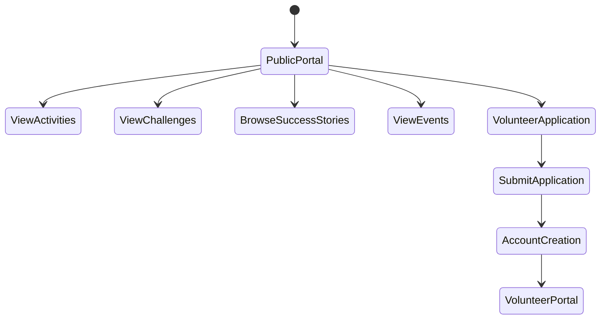
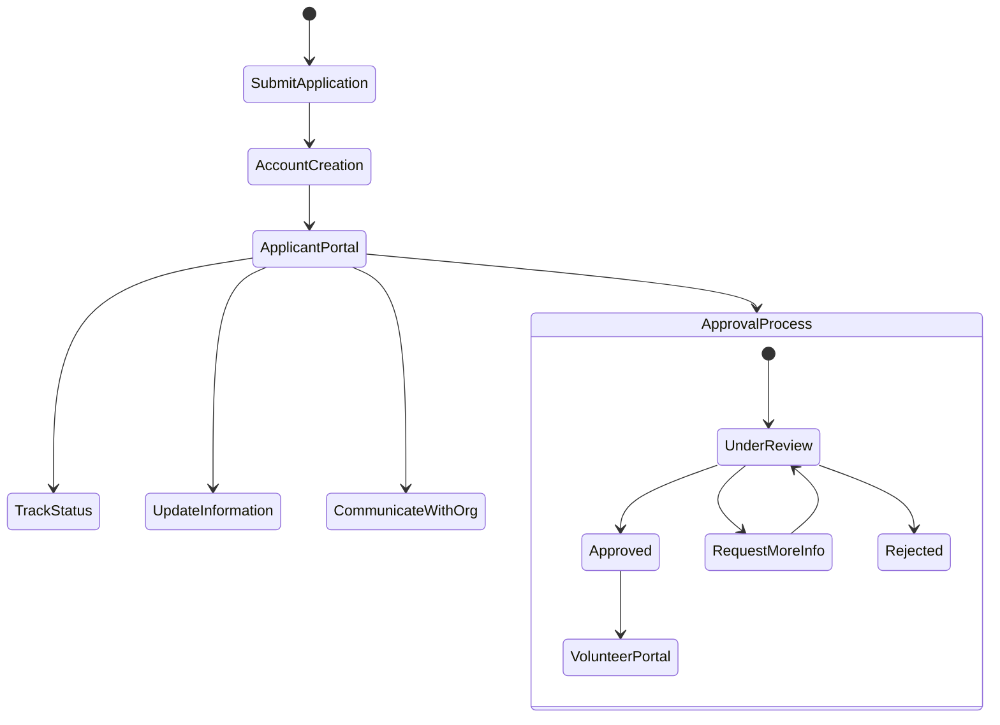
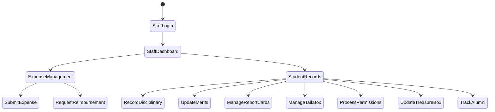
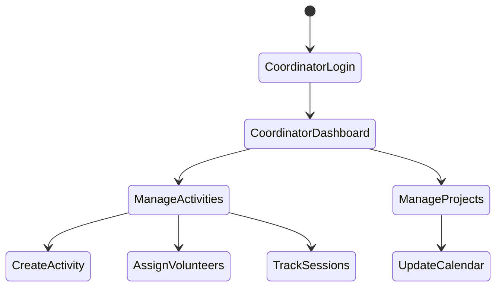
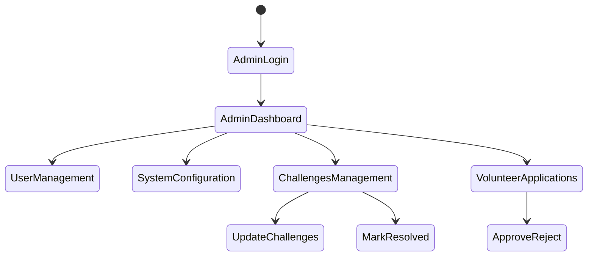
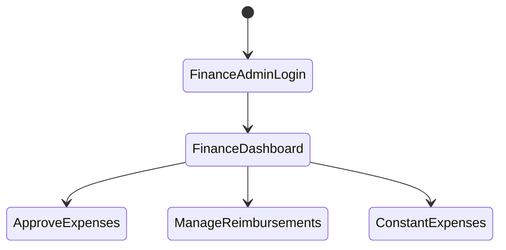

# Africa Ewaka Web Application
Complete System Specification Document

## Table of Contents
1. [System Overview](#system-overview)
2. [User Types & Access Levels](#user-types--access-levels)
3. [Core Modules](#core-modules)
4. [Department Requirements](#department-requirements)
5. [User Flows](#user-flows)
6. [Privacy & Security Considerations](#privacy--security-considerations)

## System Overview
Africa Ewaka is a comprehensive web application designed to manage educational organization operations, including finance, student activities, projects, volunteer coordination, and public engagement. The system emphasizes transparency, easy public access, and efficient internal operations management.

## User Types & Access Levels

### 1. Public Users (No Login Required)
- View organizational activities and challenges
- Browse success stories and achievements
- Access public event calendar
- View volunteer opportunities
- Submit volunteer applications

### 2. Staff Members
- Record and manage expenses
- Request reimbursements
- Manage student records
- Update merit points and disciplinary records
- Process permissions and report cards
- Manage Talk Box suggestions

### 3. Activity Coordinators
- Create and manage activities
- Coordinate with volunteers
- Update project calendars
- Track student participation
- Record learning outcomes

### 4. Volunteers
- Track application status
- View assigned activities
- Submit session feedback
- Access volunteer resources
- View and update schedules
- Communicate with coordinators

### 5. Administrators
- Manage user accounts
- Process volunteer applications
- Update organizational challenges
- Configure system settings
- Monitor all modules
- Generate system reports

### 6. Finance Administrators
- Approve expenses
- Process reimbursements
- Manage constant expenses
- Generate financial reports
- Track budgets

## Core Modules

### 1. Finance Department Module

#### Expense Management
- Individual expense recording
- Administrative approval workflow
- Reimbursement request system
- Company-wide expense tracking

#### Features
- Expense submission forms
- Approval workflows
- Reimbursement processing
- Financial year planning
- Constant expenses recording

### 2. Operations Department Module

#### Student Management
- **Disciplinary System**
  - Incident recording
  - Resolution tracking
  - Historical records

- **Merit System**
  - Top 3 students tracking per class/term
  - Gift award management
  - Performance metrics

- **Report Cards**
  - Academic performance recording
  - Term-wise tracking
  - Progress monitoring

- **Treasure Box**
  - Star award system
  - Monthly tracking
  - Achievement recognition

- **Talk Box**
  - Gender-specific suggestion boxes
  - Monthly recording
  - Feedback management

- **Permissions System**
  - Out-of-premises permission tracking
  - Detailed permission records
  - Status monitoring

- **Alumni Tracking**
  - Post-organization activities
  - Success stories
  - Engagement monitoring

#### Project Management
- Project registration
- Stakeholder management
- Activity tracking
- Calendar integration
- Progress monitoring

#### Activities Management
- Activity registration
- Volunteer assignment
- Session tracking
- Progress monitoring
- Outcome recording

### 3. Public Portal Module

#### Organization Challenges
- Public challenge listing
- Solution tracking
- Status updates
- Donor/sponsor visibility

#### Volunteer Management
- **Application System**
  - Online application form
  - Activity proposal submission
  - Reference collection
  - Account creation for volunteers after approval

- **Volunteer Portal**
  - Application status tracking
  - Activity management
  - Feedback submission
  - Resource access
  - Schedule management

#### Non-formal Arts Education
- Training program registration
- Student participation tracking
- Learning outcomes recording
- Progress monitoring
- Skill development tracking

## User Flows

### Public Access Flow

### Volunteer Application Flow

### Staff Management Flow

### Activity Coordinator Flow

### Administrator Flow

### Finance Administrator Flow

## Privacy & Security Considerations

### Student Privacy
- All public student information must be anonymized
- Success stories require proper consent
- Photo usage follows strict guidelines
- Personal information access restricted to authorized staff

### Data Protection
- Role-based access control
- Secure data storage
- Regular backups
- Audit trails for sensitive operations

### Volunteer Verification
- Reference checking system
- Document verification process
- Activity monitoring
- Regular feedback collection

### Public Content Management
- Content approval workflow
- Regular content review
- Privacy-compliant sharing
- Impact measurement

## Implementation Guidelines

### Technical Requirements
1. Web-based application
2. Responsive design
3. Secure authentication
4. Role-based access control
5. Data encryption
6. Regular backup system
7. Audit logging

### User Interface Guidelines
1. Clean, intuitive design
2. Mobile-friendly interface
3. Accessible design principles
4. Clear navigation
5. Consistent branding
6. Quick access to common functions

### Support & Maintenance
1. Regular system updates
2. User training materials
3. Technical documentation
4. Help desk system
5. Regular feedback collection
6. Performance monitoring

This specification provides a comprehensive overview of the Africa Ewaka web application. The system will be designed to be scalable, secure, and user-friendly while meeting all specified requirements for public access, volunteer management, and internal operations.
